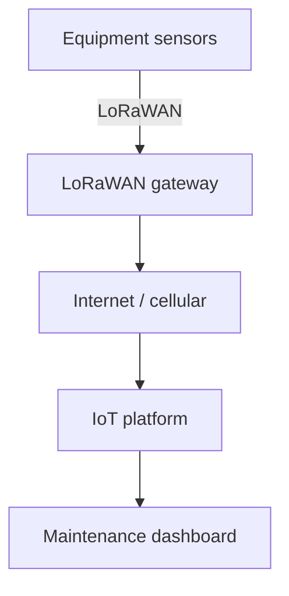
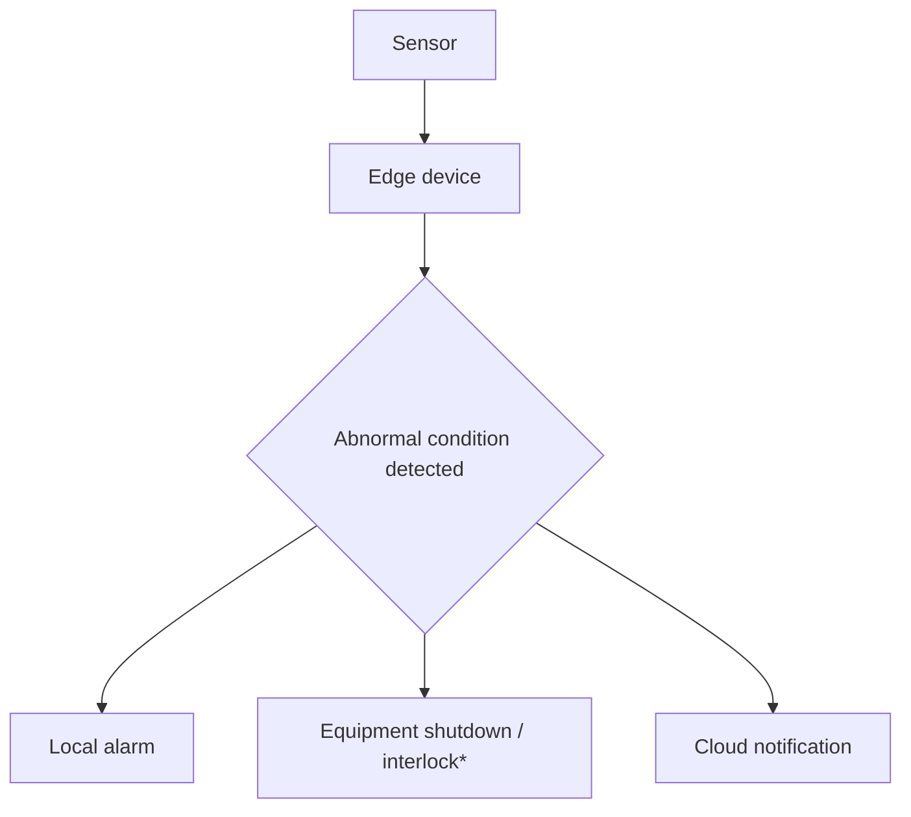
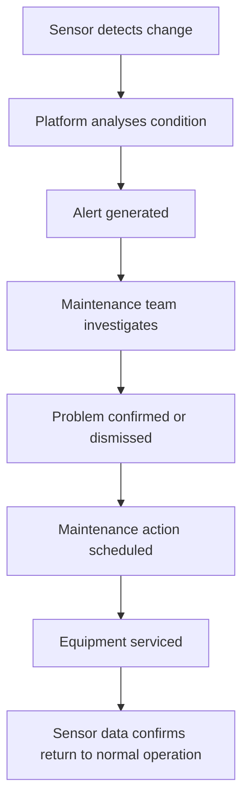

# How IoT Sensors Help Prevent Equipment Downtime

**How connected sensors, real-time monitoring and predictive maintenance can improve equipment reliability and prevent equipment downtime**

Unexpected equipment failure can be expensive.

A failed pump can interrupt production. A malfunctioning motor can stop a process. A faulty compressor can affect an entire facility. In critical infrastructure, laboratory equipment, water systems and energy installations, even a relatively small equipment failure can create significant operational consequences.

Traditional maintenance approaches often rely on fixed maintenance schedules or waiting until equipment fails. IoT sensors provide another approach by continuously monitoring equipment condition and identifying changes that may indicate an emerging problem.

By connecting equipment to an IoT monitoring platform, organisations can move from simply asking "Has the equipment failed?" to asking "Is the equipment showing signs that a failure may be developing?"

## What is IoT-based equipment monitoring?

IoT-based equipment monitoring involves installing sensors on or around equipment and continuously collecting information about its operating condition.

Depending on the application, sensors can measure:

- Temperature
- Vibration
- Pressure
- Flow
- Current
- Voltage
- Power consumption
- Humidity
- Rotation speed
- Fluid level
- Acoustic signals
- Equipment operating cycles
- Valve or switch status

The measurements are transmitted to an IoT platform where they can be visualised, stored and analysed.

A typical architecture is shown below

The important point is that the system creates a continuous connection between physical equipment and operational information.

## Why equipment fails

Equipment failures rarely happen without any preceding change.

Depending on the equipment, deterioration can result from:

- Bearing wear
- Excessive vibration
- Overheating
- Lubrication problems
- Electrical abnormalities
- Misalignment
- Excessive load
- Blocked filters
- Pressure changes
- Leakage
- Corrosion
- Mechanical wear
- Poor operating conditions

A sensor may detect one or more of these changes before the equipment reaches a complete failure condition. For example, a motor bearing may gradually become hotter and develop an unusual vibration pattern. A conventional maintenance approach may only identify the problem during a scheduled inspection or after the motor fails. An IoT monitoring system can potentially identify the developing change much earlier.

## From reactive maintenance to predictive maintenance

There are several broad approaches to equipment maintenance.

### Reactive maintenance

The equipment operates until it fails.

**Operate → Failure → Repair → Restart**

This approach can result in unexpected downtime and emergency maintenance.

### Preventive maintenance

Maintenance is performed according to a predefined schedule.

**Operate → Scheduled Maintenance → Operate**

This can reduce certain failure risks, but equipment may be serviced before it actually requires attention.

### Condition-based maintenance

Maintenance decisions are based on the actual condition of the equipment.

**Monitor → Detect Change → Assess Condition → Maintain**

This approach uses measured operating information rather than relying entirely on time or operating hours.

### Predictive maintenance

Historical and real-time data can be analysed to identify patterns associated with equipment deterioration.

**Monitor → Analyse Trends → Identify Risk → Plan Maintenance**

IoT sensors provide an important source of data for this approach.

## Temperature monitoring

Temperature is one of the simplest and most useful equipment parameters to monitor.

Many types of equipment generate heat during normal operation, but an abnormal increase can indicate a developing problem.

Examples include:

- Electric motors
- Pumps
- Gearboxes
- Bearings
- Compressors
- Electrical cabinets
- Transformers
- Power supplies
- Laboratory equipment

Rather than looking only at the absolute temperature, it can be useful to examine the trend.

For example:

A gradual increase over time may be more informative than a single high reading.

The appropriate temperature range depends on the equipment and its operating conditions, so thresholds should be established for the particular application.

## Vibration monitoring

Vibration can provide valuable information about rotating machinery.

Abnormal vibration may be associated with conditions such as:

- Bearing deterioration
- Shaft imbalance
- Misalignment
- Mechanical looseness
- Resonance
- Gear problems

A vibration sensor can continuously monitor equipment and identify changes from its normal operating pattern.

For critical rotating equipment, vibration monitoring can therefore become an important component of condition-based maintenance.

## Pressure monitoring

Pressure sensors can be used to monitor:

- Pumps
- Compressors
- Hydraulic systems
- Pneumatic systems
- Water systems
- Gas systems
- Filtration systems
- Process equipment

An unexpected pressure change can indicate a developing problem.

For example, a gradual increase in pressure across a filter may indicate that the filter is becoming blocked.

A sudden pressure reduction could indicate leakage, pump performance problems or another abnormal operating condition.

The actual interpretation depends on the equipment and process.

## Flow monitoring

Flow measurement can provide another important indication of equipment performance.

Consider a pump that normally produces a particular flow rate at a known operating condition.

If the flow gradually decreases while the pump continues to operate, possible causes could include:

- Pump wear
- Blockage
- Valve problems
- Filter restriction
- Leakage
- Changes in system conditions

Combining flow data with pressure and power measurements can provide substantially more information than monitoring flow alone.

## Electrical current and power monitoring

Electrical measurements can reveal changes in equipment behaviour.

Monitoring may include:

- Voltage
- Current
- Power
- Power factor
- Energy consumption
- Start-up current
- Operating cycles

For an electric motor, an unexpected change in current consumption may indicate a change in mechanical load or operating conditions.

Energy monitoring can also help identify equipment that is operating inefficiently.

## Combining multiple sensors

The real power of IoT monitoring often comes from combining multiple measurements.

Consider a pump.

A monitoring system could simultaneously measure:

**Vibration + Temperature + Pressure + Flow + Electrical Power**

Individually, each measurement provides useful information.

Together, they can provide a much more complete picture of the pump's operating condition.

This does not automatically prove that the pump has failed or identify the exact cause.

Instead, it provides evidence that the equipment is behaving differently and may require investigation.

## Detecting changes from normal behaviour

One of the most useful concepts in IoT equipment monitoring is establishing a baseline.

Every piece of equipment has its own normal operating characteristics.

A motor may normally operate at:

- 52°C
- 4.2 A
- Low vibration
- Stable power consumption

If the same motor gradually changes to:

- 61°C
- 5.1 A
- Increasing vibration
- Higher power consumption

the combination of changes may be more significant than any individual measurement.

The monitoring system can therefore compare current measurements with historical operating behaviour.

## Real-time alerts

An IoT platform can generate alerts when measured conditions exceed configured limits.

Examples include:

### High temperature

"Motor temperature has exceeded the configured operating limit."

### Excessive vibration

"Pump vibration has increased significantly compared with the established baseline."

### Low flow

"Flow rate has fallen below the expected operating range."

### High power consumption

"Equipment power consumption is significantly above its normal operating profile."

### Sensor communication failure

"No data has been received from the equipment monitoring sensor."

Alerts can be delivered through dashboards, email, SMS or other notification mechanisms depending on the IoT platform.

## Not every alarm means equipment failure

This is an important consideration.

A sensor detecting an abnormal value does not necessarily mean that equipment is about to fail.

Changes can occur because of:

- Different operating loads
- Start-up conditions
- Environmental temperature
- Process changes
- Maintenance activity
- Sensor positioning
- Sensor errors

The monitoring system should therefore distinguish between normal operational variation and genuinely abnormal behaviour.

This is one reason why historical data and contextual information are important.

## The importance of time-series data

A single sensor reading provides limited information.

A time series provides context.

For example:

The trend suggests that the equipment is progressively operating at a higher temperature.

A maintenance team can investigate the cause before the equipment reaches a more serious condition.

## Predictive maintenance using data analytics

Once sufficient historical data has been collected, more sophisticated analytics can be introduced.

These may include:

- Trend analysis
- Statistical analysis
- Anomaly detection
- Threshold-based rules
- Correlation analysis
- Machine-learning models
- Remaining-useful-life estimation

Not every application requires artificial intelligence or machine learning.

In many cases, simple and well-designed rules based on reliable sensor data can provide substantial operational value.

A good monitoring system should therefore start with the business and engineering problem rather than assuming that complex analytics are always necessary.

## Digital dashboards for maintenance teams

An IoT dashboard can provide maintenance personnel with a central view of equipment condition.

For example:

| Equipment | Temperature | Vibration | Power | Status |
| --- | --- | --- | --- | --- |
| Pump 01 | 54°C | Normal | 4.1 kW | Normal |
| Pump 02 | 67°C | High | 5.2 kW | Investigate |
| Motor 03 | 49°C | Normal | 3.8 kW | Normal |
| Compressor 01 | 71°C | Moderate | 8.4 kW | Monitor |

A dashboard can also provide historical graphs, alarm history and equipment-level details.

This allows maintenance teams to focus attention on equipment that requires investigation.

## Monitoring equipment remotely

IoT monitoring becomes particularly valuable when equipment is geographically distributed.

Examples include:

- Water pumping stations
- Remote energy installations
- Agricultural infrastructure
- Mining sites
- Telecommunications infrastructure
- Building services
- Remote laboratories
- Environmental monitoring stations

Instead of physically visiting every location to obtain measurements, operators can monitor equipment remotely.

This can reduce unnecessary inspection visits while allowing maintenance personnel to investigate abnormal conditions when required.

## LoRaWAN for equipment monitoring

For some applications, LoRaWAN can provide an effective communication layer for equipment sensors.

LoRaWAN is particularly suitable for:

- Low-power sensors
- Distributed equipment
- Remote monitoring locations
- Small periodic data transmissions
- Sites where installing network cabling is difficult

For example:

The appropriate communication technology depends on the application.

Industrial environments may also require Ethernet, Wi-Fi, cellular, private wireless networks or wired industrial protocols.

The objective should be to select the communication technology that best matches the equipment, environment and operational requirements.

## Edge computing and local decisions

Not every decision needs to be made in the cloud.

An IoT gateway or edge device can process data locally.

For example:

\*Where appropriate and engineered as part of the equipment's safety and control system.

This can be useful when rapid response is required or when Internet connectivity is intermittent.

IoT monitoring should not automatically be substituted for properly engineered safety-critical control systems.

## Equipment monitoring in buildings

IoT sensors can also help monitor building services.

Examples include:

- Air-conditioning equipment
- Pumps
- Fans
- Chillers
- Air-handling units
- Refrigeration
- Electrical systems
- Water systems

Monitoring temperature, vibration, pressure, current and operating status can help facility managers identify developing equipment problems.

This can complement building-management systems rather than necessarily replacing them.

## Water and pump infrastructure

Water infrastructure is particularly well suited to remote IoT monitoring.

Sensors can monitor:

- Pump status
- Pressure
- Flow
- Tank levels
- Motor temperature
- Electrical consumption
- Vibration
- Valve status

A remote monitoring platform can provide operators with a central view of distributed infrastructure.

This can be valuable for agricultural, industrial, municipal and environmental applications.

## Laboratory equipment monitoring

Laboratory equipment can also benefit from condition monitoring.

Depending on the equipment, parameters may include:

- Temperature
- Pressure
- Flow
- Vacuum
- Electrical consumption
- Door status
- Operating cycles
- Environmental conditions

Monitoring can provide early indications of equipment abnormalities and can also help establish a historical operating record.

For critical laboratory processes, monitoring can be combined with appropriate alarms and operational procedures.

## From alarms to maintenance workflows

The objective of an IoT monitoring system should not simply be to generate alarms.

A useful workflow is:

This closes the loop between monitoring and maintenance.

## Measuring the value of IoT monitoring

An equipment-monitoring project should have measurable objectives.

Possible measures include:

- Reduction in unplanned downtime
- Reduction in emergency maintenance
- Reduction in inspection visits
- Faster fault identification
- Improved equipment availability
- Improved maintenance planning
- Reduced maintenance cost
- Increased equipment life
- Improved energy efficiency

The value will vary considerably between applications.

A monitoring system should therefore be designed around specific operational problems rather than simply collecting large amounts of sensor data.

## A practical approach to implementing IoT condition monitoring

A successful project does not need to monitor every piece of equipment from day one.

### Step 1 — Identify critical equipment

Start with equipment where unexpected failure has significant consequences.

### Step 2 — Understand failure modes

Determine how the equipment typically deteriorates or fails.

### Step 3 — Select appropriate sensors

Choose sensors that can detect meaningful changes in those failure modes.

### Step 4 — Establish a baseline

Collect sufficient data to understand normal operating behaviour.

### Step 5 — Create useful alerts

Configure thresholds and anomaly rules appropriate to the equipment.

### Step 6 — Integrate maintenance processes

Ensure that someone is responsible for investigating important alerts.

### Step 7 — Analyse historical data

Look for recurring patterns and relationships between sensor measurements and equipment failures.

### Step 8 — Expand gradually

Extend monitoring to additional equipment once the initial system has demonstrated operational value.

## IoT monitoring is more than installing sensors

Installing a sensor is relatively straightforward.

Creating a useful equipment-monitoring system requires considerably more consideration.

The complete system should address:

### Sensor selection

→ Is the sensor appropriate for the equipment?

### Installation

→ Is it measuring the right physical condition?

### Connectivity

→ Can the data reliably reach the platform?

### Data quality

→ Are the measurements reliable?

### Analytics

→ Can meaningful changes be identified?

### Alerts

→ Will the right people know when action is required?

### Maintenance

→ Is there a process for responding?

The value of IoT therefore comes from connecting these components into a complete operational system.

## Conclusion

IoT sensors can help organisations detect changes in equipment condition before those changes develop into unexpected failures.

By continuously monitoring parameters such as temperature, vibration, pressure, flow and electrical power, organisations can develop a clearer understanding of how equipment behaves during normal operation.

Historical data can establish equipment baselines, while alerts and analytics can help maintenance teams identify abnormal conditions and investigate them before they result in significant downtime.

IoT monitoring does not guarantee that equipment will never fail. Its value lies in providing better information, earlier warning and greater visibility into equipment condition.

For Australian businesses operating distributed infrastructure, industrial equipment, buildings, agricultural systems, laboratories and environmental assets, connected condition monitoring can form an important part of a modern maintenance strategy.

Novel Aquatech can combine IoT sensors, communications technologies, embedded systems and data platforms to develop monitoring solutions tailored to specific equipment and operational environments.

## Practical checklist

Before implementing an IoT equipment-monitoring system, consider:

- Identify critical equipment
- Identify common equipment failure modes
- Determine which parameters indicate equipment condition
- Select appropriate sensors
- Determine sensor installation locations
- Establish normal operating baselines
- Select appropriate communication technology
- Provide reliable gateway/connectivity infrastructure
- Develop a central monitoring dashboard
- Configure meaningful alerts
- Establish maintenance response procedures
- Store historical data
- Analyse equipment trends
- Measure reduction in unplanned downtime
- Expand the system based on demonstrated value
