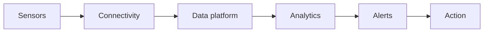

# How to Interpret CO₂, PM2.5, VOC, Temperature and Humidity Data

**A practical guide to understanding indoor air quality and environmental sensor data**

Modern buildings can contain hundreds of sensors measuring temperature, humidity, carbon dioxide (CO₂), particulate matter and volatile organic compounds (VOCs).

Collecting this information is relatively easy.

The more difficult question is:

### What does the data actually mean?

A sensor may report a CO₂ concentration of 1,200 ppm, PM2.5 of 15 µg/m³, relative humidity of 65% and a particular TVOC reading. But what should a building manager do with those numbers?

The answer depends on the parameter being measured, the building, occupancy, ventilation, outdoor conditions, sensor characteristics and the purpose of the monitoring system.

This article explains how to interpret five commonly monitored indoor environmental parameters:

- CO₂
- PM2.5
- VOC
- Temperature
- Relative humidity

The objective is not simply to identify whether a number is "high" or "low", but to understand patterns, trends and relationships between measurements.

## 1. Why Indoor Air Quality Data Needs to Be Interpreted Carefully

Indoor environmental monitoring can generate large amounts of data.

A sensor might record a measurement every minute, producing thousands of readings every month. Looking at individual readings is rarely sufficient.

For example:

The important information is not necessarily the maximum value.

The shape of the curve may tell us much more.

If CO₂ consistently rises when a meeting room becomes occupied and falls after the room is ventilated, the data provides evidence about the relationship between occupancy and ventilation.

This is one of the main advantages of continuous monitoring.

## 2. CO₂ — A Useful Indicator of Ventilation

Carbon dioxide is one of the most measured parameters in indoor environmental monitoring. People continuously produce CO₂ when they breathe.

Consequently, CO₂ concentration inside an occupied building is influenced by:

- Number of occupants
- Outdoor CO₂ concentration
- Ventilation rate
- Air distribution
- Room volume
- Occupancy duration

For many buildings, CO₂ is therefore useful as an indicator of ventilation performance. However, this distinction is important:

Indoor CO₂ is often used as a ventilation indicator; it should not automatically be interpreted as a direct measure of overall indoor air quality. A room can have an acceptable CO₂ concentration while still containing other pollutants.

## 3. How to Interpret CO₂ Trends

Suppose a meeting room begins the day with relatively low CO₂. When people enter the room, CO₂ starts increasing. When the meeting finishes and the room becomes empty, CO₂ begins to decrease. This pattern might look like:

This tells us considerably more than a single CO₂ reading.

### Look for:

- How quickly CO₂ rises
- Maximum concentration
- How long elevated levels persist
- How quickly CO₂ falls
- Whether the pattern repeats every day
- Whether different rooms behave differently

## 4. Rapidly Rising CO₂

A rapid increase in CO₂ after occupants enter a room may indicate that the rate at which CO₂ is being generated by occupants is greater than the rate at which it is being removed through ventilation. Possible contributing factors include:

- High occupancy
- Insufficient outdoor-air ventilation
- Poor air distribution
- HVAC operating schedules
- Closed doors
- Changes in building operation

However, the sensor location and measurement conditions should always be checked before drawing conclusions.

## 5. Persistently Elevated CO₂

A room where CO₂ remains elevated for long periods during occupancy deserves investigation. Possible causes may include:

- Insufficient ventilation
- HVAC malfunction
- Incorrect ventilation settings
- High occupancy
- Changes in room use
- Poor air distribution

The appropriate response is generally to investigate the building's ventilation system rather than simply treating the sensor reading itself as the problem.

## 6. CO₂ Falling Slowly

After occupants leave a room, CO₂ should generally begin moving back toward the outdoor/background concentration. If it falls very slowly, possible explanations include:

- Low ventilation
- Room isolation
- HVAC operating schedule
- Poor air mixing
- Sensor location

Again, the trend is more informative than a single reading.

## 7. Do Not Treat CO₂ as a Complete IAQ Measurement

CO₂ does not measure:

- PM2.5
- VOCs
- Carbon monoxide
- Formaldehyde
- Ozone
- Biological contaminants

Therefore:

A low CO₂ reading does not necessarily mean that all aspects of indoor air quality are good. This is why multi-parameter monitoring can provide a much more complete picture.

## 8. PM2.5 — Understanding Fine Particles

PM2.5 refers to particulate matter with an aerodynamic diameter of approximately 2.5 micrometres or smaller.

These particles are small enough to penetrate deeply into the respiratory system, which is why PM2.5 is an important environmental monitoring parameter.

Indoor PM2.5 can originate from both outdoor and indoor sources.

Potential sources include:

- Outdoor air pollution
- Cooking
- Combustion
- Candles
- Incense
- Smoking
- Dust
- Certain industrial processes
- Some indoor activities

## 9. How to Interpret PM2.5 Data

PM2.5 data should be examined both in terms of concentration and time.

For example,

A short-lived peak may have a very different cause from a persistent elevation.

### Short peak

A sudden increase could be associated with:

- Cooking
- Cleaning
- Dust disturbance
- An indoor activity

### Persistent elevation

A prolonged increase could indicate:

- Outdoor pollution entering the building
- Continuous indoor particle generation
- Poor filtration
- Insufficient ventilation
- An indoor combustion source

## 10. Look at Indoor and Outdoor PM2.5 Together

One of the most useful ways of interpreting PM2.5 data is to compare indoor measurements with outdoor conditions.

For example:

If outdoor PM2.5 rises and indoor PM2.5 subsequently rises, this may suggest that outdoor particles are entering the building. If indoor PM2.5 rises while outdoor PM2.5 remains relatively stable, an indoor source may deserve investigation. This is an example of why correlation between sensors can be more informative than an isolated measurement.

## 11. PM2.5 and Air Purifiers

If an air purifier is operating, PM2.5 data can be particularly useful.

A typical pattern might be:

A sustained reduction after the purifier starts operating provides evidence that the purifier is affecting measured particle concentration.

This type of before-and-after analysis can be useful when evaluating building interventions.

## 12. VOC — What Does a VOC Reading Mean?

Volatile organic compounds are a broad group of chemicals that can be present in indoor environments. Potential sources include:

- Cleaning products
- Paints
- Adhesives
- Solvents
- Furnishings
- Building materials
- Personal-care products
- Printing activities

However, interpreting VOC data requires particular care.

Many low-cost IAQ sensors do not identify individual VOCs.

Instead, they may provide:

- TVOC
- VOC index
- Relative VOC level
- A sensor-specific estimate

These values are not necessarily equivalent to a laboratory measurement of a particular chemical.

## 13. TVOC Is Not the Same as Measuring Individual VOCs

This is an important distinction. A sensor reporting: TVOC = 350 ppb does not necessarily mean that 350 ppb of one chemical has been measured.

Different sensor technologies use different detection methods and algorithms.

Consequently, TVOC readings from different sensor manufacturers should not automatically be treated as directly comparable. When interpreting VOC data, always check:

- Sensor technology
- Calibration method
- Units
- Manufacturer's measurement range
- Sensor response characteristics
- Whether the measurement is absolute or relative

## 14. How to Interpret VOC Trends

VOC sensors can be particularly useful for identifying changes and events.

For example, a sudden VOC increase might correspond to:

- Cleaning
- Painting
- Use of solvents
- Application of personal-care products
- Introduction of new materials

If the increase repeatedly occurs at a particular time, the sensor data may help identify the source.

## 15. Temperature — More Than Just Comfort

Temperature is one of the simplest environmental parameters to measure, but it provides valuable information. Indoor temperature can influence:

- Thermal comfort
- HVAC operation
- Energy consumption
- Relative humidity
- Building conditions
- Sensor performance

A temperature sensor can also reveal differences between areas of a building.

For example:

Office A: 22°C

Office B: 24°C

Meeting Room: 27°C

Server Room: 30°C

The differences may indicate different HVAC conditions, solar exposure, occupancy or equipment heat loads.

## 16. Look for Temperature Trends

Temperature should generally be interpreted over time.

A graph may reveal:

- Overnight temperature reduction
- Morning HVAC startup
- Solar heating
- Occupancy effects
- HVAC shutdown
- Weekend behaviour

For example:

A large temperature increase during the afternoon might be associated with solar gain or insufficient cooling capacity.

## 17. Relative Humidity

Relative humidity (RH) describes the amount of moisture in air relative to the maximum amount of water vapour the air can hold at that temperature.

Relative humidity is strongly dependent on temperature.

This means that humidity should generally be interpreted together with temperature.

For example, heating air can reduce its relative humidity even though the actual amount of moisture in the air has not changed.

## 18. Why Humidity Matters

Humidity can affect:

- Thermal comfort
- Condensation
- Mould risk
- Building materials
- Equipment
- Electronics
- Some biological processes

Very high humidity can increase the potential for condensation and moisture-related problems. Very low humidity can contribute to discomfort and dry conditions.

However, there is no single humidity value that guarantees good indoor environmental conditions in every building. Building type, climate, temperature and occupancy all matter.

## 19. Look for Persistent High Humidity

A short period of elevated humidity may not necessarily indicate a building problem.

Persistent elevation deserves more attention.

Possible causes include:

- Water ingress
- Poor ventilation
- Moisture generation
- Bathrooms
- Kitchens
- Ground moisture
- HVAC problems
- Building-envelope issues

Comparing humidity between rooms can help identify where the problem is occurring.

## 20. Temperature and Humidity Should Be Interpreted Together

Consider a room with:

- Temperature: 24°C
- Relative humidity: 70%

The humidity reading becomes more meaningful when considered alongside temperature and the building environment.

A second room might show:

- Temperature: 18°C
- Relative humidity: 70%

The relative humidity is identical, but the moisture conditions are not identical.

For more advanced analysis, absolute humidity or dew point can sometimes provide useful additional information.

## 21. The Importance of Dew Point

Dew point is the temperature at which air becomes saturated with water vapour.

It can be particularly useful for identifying potential condensation problems.

For example, if a building contains a cold surface whose temperature falls below the indoor air's dew point, condensation may occur.

This can be important around:

- Windows
- Cold pipes
- Air-conditioning equipment
- Refrigeration systems
- External walls

An IAQ system that measures temperature and humidity can calculate or estimate dew point and provide an additional indicator for building monitoring.

## 22. Look at the Parameters Together

The real value of an IAQ monitoring system often comes from combining multiple measurements.

Consider this example:

| Parameter | Observation |
| --- | --- |
| CO₂ | Rising rapidly |
| PM2.5 | Stable |
| VOC | Stable |
| Temperature | Stable |
| Humidity | Stable |

This pattern may point toward an occupancy/ventilation issue rather than a general pollution event.

Now consider:

| Parameter | Observation |
| --- | --- |
| CO₂ | Stable |
| PM2.5 | Rapid increase |
| VOC | Rapid increase |
| Temperature | Stable |
| Humidity | Stable |

This could suggest a local activity or pollution source.

The sensor data does not automatically identify the cause, but it helps narrow the investigation.

## 23. Use Time-Series Data

Continuous monitoring allows building operators to answer questions such as:

- When does CO₂ rise?
- Which rooms have the highest PM2.5?
- When do VOC levels change?
- Which rooms become too warm?
- When does humidity increase?
- What happens when HVAC systems start?
- What happens when the building is occupied?
- What happens after the building closes?

These questions are difficult to answer using occasional manual measurements.

## 24. Compare Similar Rooms

Another useful technique is comparing rooms with similar functions.

For example:

If Room C consistently behaves differently from otherwise similar rooms, it may deserve investigation.

Possible explanations include:

- Different occupancy
- Different ventilation
- Different location
- Different outdoor exposure
- Different equipment
- Different sensor placement

## 25. Compare Before and After an Intervention

Sensor data becomes particularly valuable when evaluating a building improvement.

For example, suppose a building operator modifies the ventilation system.

Instead of simply asking:

"Did the modification work?" the operator can compare:

### Before intervention

versus

### After intervention

for:

- CO₂
- PM2.5
- Temperature
- Humidity
- VOC trends

This provides an evidence-based way to evaluate changes in building operation.

## 26. Beware of Sensor Limitations

No sensor is perfect. When interpreting IAQ data, consider:

- Accuracy
- Precision
- Calibration
- Sensor drift
- Cross-sensitivity
- Environmental effects
- Response time
- Measurement range
- Installation location

Low-cost sensors can be extremely useful for monitoring trends, but they should not automatically be treated as equivalent to laboratory-grade analytical instruments.

## 27. Sensor Calibration and Validation

Sensors should be maintained according to the manufacturer's recommendations.

Depending on the sensor and application, this may involve:

- Calibration
- Functional testing
- Reference comparison
- Replacement
- Cleaning
- Firmware updates

A sensor that suddenly reports an unusual value should not immediately be interpreted as evidence of a building problem. First ask:

### Could the sensor itself be responsible for the change?

## 28. Don't Chase Every Single Reading

One of the biggest mistakes in interpreting environmental sensor data is reacting to every short-term fluctuation. Environmental conditions naturally vary. A better approach is to look at:

- Trends
- Duration
- Frequency
- Magnitude
- Repetition
- Correlation with occupancy
- Correlation with HVAC operation
- Correlation with outdoor conditions

For example, a five-minute PM2.5 spike may be much less significant than a sustained elevation lasting several hours.

## 29. A Practical IAQ Data Interpretation Framework

A useful five-step process is:

### Step 1 — Observe

What is the sensor reporting?

### Step 2 — Compare

How does it compare with:

- Previous measurements?
- Other rooms?
- Outdoor conditions?
- Normal operating conditions?

### Step 3 — Identify the pattern

Is the change:

- Sudden?
- Gradual?
- Repeating?
- Persistent?
- Occupancy-related?

### Step 4 — Investigate

What building activity or environmental condition might explain it?

### Step 5 — Verify

After making an intervention, continue monitoring to determine whether the expected change occurred.

This transforms an IoT sensor from a simple measuring device into a tool for building management.

## 30. Example: Interpreting a Meeting Room

Consider a meeting room monitored continuously.

At 8:00 am:

- CO₂: low
- PM2.5: low
- VOC: low
- Temperature: comfortable
- Humidity: moderate

At 10:00 am, twelve people enter.

Over the next hour:

- CO₂ rises significantly
- PM2.5 remains relatively stable
- VOC remains relatively stable
- Temperature increases slightly
- Humidity increases slightly

After the meeting:

- Occupants leave
- CO₂ gradually falls
- Temperature falls
- Humidity falls

The combined pattern provides useful evidence about the relationship between occupancy and room ventilation.

## 31. Example: Identifying a Possible Indoor Particle Source

Consider an office where PM2.5 normally remains relatively low. Every afternoon at approximately 3:00 pm, PM2.5 rises sharply. Outdoor PM2.5 remains relatively stable. The pattern repeats over several days. This suggests that the source may be associated with an indoor activity occurring around that time. Further investigation might examine:

- Cleaning activities
- Printing
- Food preparation
- Maintenance
- Occupant activities
- Air-cleaning equipment

A temporary particle spike during cleaning is one possible pattern:

The sensor does not identify the source by itself. Instead, it provides evidence that helps direct the investigation.

## 32. Example: Identifying a Ventilation Pattern

Suppose a classroom repeatedly shows:

- Low CO₂ before occupancy
- Rapid CO₂ increase after students arrive
- Slow decline during breaks
- Persistent elevation during occupied periods

If other environmental parameters remain relatively stable, the data may justify investigating ventilation performance and HVAC operation. A building operator can then compare the data before and after changes to the ventilation system.

## 33. From Sensors to Intelligent Buildings

The ultimate value of indoor environmental monitoring is not the sensor itself.

It is the information generated from the sensor network.

A modern system can combine:

For example:

This architecture can enable building operators to move from occasional inspection toward continuous monitoring.

## 34. Why Trends Matter More Than Individual Numbers

The most important lesson when interpreting indoor environmental data is:

**Context matters.**

A single measurement provides limited information.

A time series can reveal:

- Trends
- Patterns
- Relationships
- Events
- Anomalies
- Repeated problems

And when several sensors are considered together, the information becomes considerably more useful.

## Conclusion

CO₂, PM2.5, VOC, temperature and humidity sensors can provide valuable insight into the indoor environment. However, the numbers should not be interpreted in isolation.

CO₂ can provide useful information about occupancy and ventilation.

PM2.5 can reveal changes in fine-particle concentration and help identify potential indoor or outdoor sources.

VOC measurements can reveal changes associated with chemicals and indoor activities, although sensor-specific limitations and the meaning of TVOC readings must be understood.

Temperature provides information about thermal conditions, HVAC operation and differences between areas of a building.

Humidity provides information about moisture conditions, comfort and potential condensation-related problems.

The most useful approach is to look at patterns over time and relationships between different measurements. A well-designed monitoring system can therefore do much more than display numbers. It can help building operators understand how their buildings behave, identify unusual conditions and evaluate the effect of changes to ventilation, HVAC systems and building operations. For Novel Aquatech, this is an important part of the broader vision for intelligent environmental monitoring: combining sensors, wireless connectivity, IoT platforms and data analytics to provide practical information for healthier, more efficient and more sustainable buildings.

## Practical Interpretation Checklist

When reviewing IAQ sensor data, ask:

### CO₂

- Is the room occupied?
- How quickly is CO₂ rising?
- How long does it remain elevated?
- How quickly does it fall after occupancy?

### PM2.5

- Is the increase short-term or persistent?
- Is outdoor PM2.5 also elevated?
- Are there indoor activities that could explain the change?

### VOC

- Is the reading absolute, TVOC or a sensor-specific index?
- Did a particular activity coincide with the increase?
- Is the change repeatable?

### Temperature

- Is the temperature changing with occupancy?
- Is solar gain involved?
- Is the HVAC system operating normally?

### Humidity

- Is the humidity persistently high or low?
- Does it change with occupancy?
- Is there evidence of moisture generation or condensation risk?

### Overall

- Does the pattern repeat?
- Do multiple sensors show the same behaviour?
- Does the data agree with what is happening in the building?
