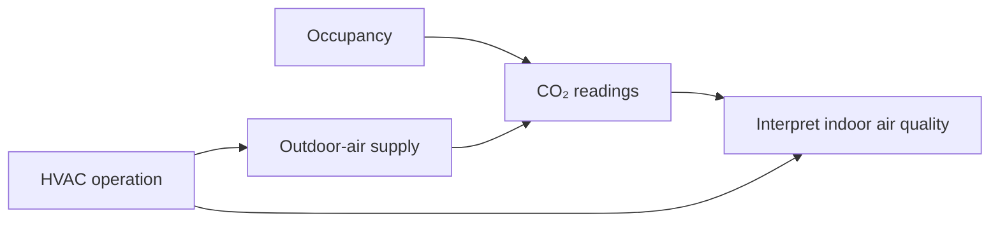

# Indoor Air Quality Monitoring for Australian Offices

Indoor air quality (IAQ) has become an increasingly important consideration for Australian workplaces. Modern offices are designed to be energy efficient, comfortable and highly connected, but they can also become environments where pollutants accumulate when ventilation, filtration, occupancy and building operation are not properly managed.

For Australian businesses, continuous indoor air quality monitoring provides a practical way to understand what is happening inside an office and to identify ventilation or environmental problems before they become significant workplace issues.

Australia's first national report on indoor air quality, published in 2025, highlighted significant gaps in the available data on indoor air quality across Australian buildings. The report identified carbon dioxide (CO₂), particulate matter (PM), volatile organic compounds (VOCs), nitrogen dioxide and formaldehyde among the important pollutants found indoors. [QUT report](https://www.qut.edu.au/news?id=202091)

## Why Indoor Air Quality Matters

Office workers can spend a large proportion of their day indoors. The quality of the indoor environment therefore influences not only comfort, but potentially health, wellbeing, concentration and productivity.

Poorly ventilated offices may experience:

- Elevated CO₂ concentrations
- Stale or stuffy air
- Unpleasant odours
- Excess humidity or excessively dry air
- Increased particulate matter
- VOC accumulation from furniture, carpets, cleaning products and office equipment
- Temperature discomfort
- Increased exposure to pollutants entering from outside
- Complaints of headaches, fatigue, irritation or general discomfort

SafeWork NSW notes that poor workplace ventilation can create health and safety hazards and specifically identifies elevated CO₂ as one possible indication of inadequate ventilation. [SafeWork NSW](https://www.safework.nsw.gov.au/hazards-a-z/ventilation-at-work).

Importantly, good IAQ is not simply a matter of keeping the temperature comfortable. An office can have a pleasant temperature while simultaneously having inadequate ventilation or elevated pollutant concentrations.

## What Should Australian Offices Monitor?

A modern IAQ monitoring system should ideally monitor several environmental parameters rather than relying on a single CO₂ sensor.

### 1. Carbon Dioxide — CO₂

CO₂ is one of the most useful parameters for assessing ventilation performance in occupied offices.

People continuously exhale CO₂. When occupancy increases and outdoor-air ventilation does not increase correspondingly, indoor CO₂ concentrations can rise.

CO₂ is therefore useful as an indicator of ventilation effectiveness and occupancy-related bioeffluent accumulation.

It is important, however, not to interpret CO₂ as a direct measurement of overall air quality or airborne infection risk. The ABCB specifically notes that CO₂ is commonly monitored as an indicator of occupancy and human bioeffluent rather than as a contaminant of health concern at typical office concentrations. [ABCB](https://www.abcb.gov.au/sites/default/files/resources/2022/Handbook-indoor-air-quality.pdf)

Australian guidance also provides useful context around ventilation. WorkSafe Victoria's current office guidance refers to AS 1668.2:2024 and a minimum effective outdoor-airflow requirement of 10 L/s per person for office areas under the relevant conditions. [WorkSafe Victoria](https://www.worksafe.vic.gov.au/office-health-and-safety-designing-healthy-and-safe-working-environment)

### 2. Particulate Matter — PM₂.₅ and PM₁₀

Fine particles can enter an office from outdoor air, vehicle emissions, construction activities and bushfire smoke. They can also be generated indoors.

PM₂.₅ is particularly useful to monitor because very small particles can remain suspended in indoor air for extended periods.

Continuous monitoring can help building managers identify:

- Bushfire smoke intrusion
- Outdoor pollution events
- Poor filtration
- Indoor particle-generation events
- Changes associated with HVAC operation

### 3. Temperature

Temperature is fundamental to occupant comfort.

Monitoring temperature across multiple areas can also reveal:

- HVAC imbalance
- Hot or cold zones
- Poor air distribution
- Equipment-related heat loads
- Occupancy-related changes

A single temperature sensor may not accurately represent the conditions experienced throughout a large office.

### 4. Relative Humidity

Humidity affects both occupant comfort and the building environment.

Very high humidity can contribute to condensation and conditions favourable to mould growth, while very low humidity can contribute to discomfort and dryness.

Monitoring temperature and relative humidity together provides a much better picture of the indoor thermal environment.

### 5. Volatile Organic Compounds — VOCs

VOCs may originate from:

- Furniture
- Carpets
- Paints and coatings
- Cleaning products
- Adhesives
- Printing equipment
- Personal-care products
- Building materials

A TVOC sensor can provide an indication of changes in the overall VOC environment and can be particularly useful for identifying unusual events or changes following refurbishment or changes in cleaning practices.

### 6. Carbon Monoxide — CO

CO is particularly important where there are potential combustion sources or where outdoor pollution can enter the building.

Unlike CO₂, carbon monoxide is a toxic pollutant, so CO monitoring should be considered where the building's risk profile warrants it.

### 7. Other Parameters

Depending on the building and application, monitoring may also include:

- Formaldehyde
- Nitrogen dioxide
- Ozone
- Air pressure
- Air velocity
- Occupancy
- Noise
- Light levels
- HVAC operating status
- Energy consumption

The objective should not be to install every possible sensor. The monitoring strategy should be designed around the building, its occupants, its HVAC system and its potential pollutant sources.

## CO₂ Monitoring: A Particularly Useful Starting Point

For many Australian offices, CO₂ is an excellent starting point for IAQ monitoring because it provides a relatively simple way of identifying ventilation patterns.

Consider an office with 30 employees.

At 8:00 am, the office may have relatively low occupancy and CO₂ may be close to outdoor levels.

By 10:30 am, most employees have arrived. If the HVAC system continues supplying approximately the same quantity of outdoor air, CO₂ may progressively increase.

By monitoring CO₂ continuously, the building operator can see this pattern rather than discovering the problem only after employees begin complaining about stuffiness.

The important point is that CO₂ should be interpreted in context.

The ABCB's indoor air quality guidance discusses an 850 ppm eight-hour maximum contaminant value within its IAQ verification methodology, while other Australian guidance uses CO₂ differently as an indicator of ventilation effectiveness. [ABCB](https://www.abcb.gov.au/sites/default/files/resources/2022/Handbook-indoor-air-quality.pdf)

Therefore, a monitoring system should not simply display a number and label it "safe" or "unsafe". It should help users understand:

What is happening? Why is it happening? What action should be taken?

## Continuous Monitoring Is Better Than Occasional Measurement

Traditional IAQ assessment often involves periodic measurements.

For example, an environmental consultant may visit an office and measure temperature, humidity, CO₂ and other parameters at selected locations.

This can provide valuable information, but it is essentially a snapshot.

Office environments are dynamic.

Occupancy changes throughout the day. Meetings increase the number of people in rooms. HVAC systems change operating modes. Windows may be opened or closed. Outdoor pollution can change rapidly. Cleaning activities can generate temporary VOC peaks.

Continuous monitoring provides a different level of information.

Instead of asking:

"What was the air quality when the consultant visited?"

facility managers can ask:

"How has the indoor environment performed over the last 24 hours, week or month?"

This distinction can be extremely valuable.

## From Sensors to an Intelligent IAQ Platform

The next generation of office IAQ systems should go beyond individual sensors.

A network of wireless environmental sensors can be distributed throughout an office and connected to a central cloud or local platform.

A typical architecture could look like:

Sensors can continuously transmit measurements such as:

CO₂, PM₂.₅, PM₁₀, temperature, humidity, TVOC, CO, occupancy and HVAC status.

The platform can then transform this raw information into useful operational information.

For example:

### Normal

- CO₂: 620 ppm
- Temperature: 22.8°C
- Humidity: 52%
- PM₂.₅: Low

**Status: Good**

### Attention

- CO₂: 1,050 ppm
- Temperature: 23.4°C
- Humidity: 54%

**Status: Ventilation may require attention**

### Investigation Required

PM₂.₅ suddenly increases while outdoor air quality deteriorates.

**Status: Check outdoor air intake and filtration**

This approach makes IAQ monitoring much more useful to facility managers.

## IAQ Monitoring and HVAC Systems

One of the most important applications of IAQ monitoring is understanding the relationship between indoor conditions and HVAC operation.

A monitoring system can potentially correlate:

For example, if CO₂ repeatedly rises above a selected threshold in a meeting room whenever occupancy exceeds a certain level, the problem may not be the occupants.

The issue could be:

- Insufficient outdoor-air supply
- Incorrect HVAC control settings
- Blocked filters
- Poor air distribution
- Incorrect occupancy assumptions
- A malfunctioning damper
- A sensor or control-system problem

Monitoring can therefore become a diagnostic tool, rather than simply an alarm system.

## IAQ and Occupant Perception

Occupants' experience is another part of indoor air quality. The diagram shows how measured conditions and other factors shape what people perceive:

Two offices can have similar measured environmental conditions but different occupant perceptions.

People may describe an office as:

- Fresh
- Stuffy
- Comfortable
- Too warm
- Too cold
- Smelly
- Dry
- Humid

This is why the combination of objective sensor measurements and occupant feedback can be particularly powerful.

For example:

| Sensor Data | Occupant Feedback |
| --- | --- |
| CO₂ = 650 ppm | Air feels fresh |
| CO₂ = 1,100 ppm | Air feels stuffy |
| Temperature = 23°C | Comfortable |
| Temperature = 26°C | Too warm |
| TVOC increases | Odour reported |
| PM₂.₅ increases | No perception initially |

This creates an opportunity for organisations to investigate the relationship between measured IAQ, occupant perception and workplace productivity.

That is particularly relevant for modern Australian workplaces where employee wellbeing and workplace experience are increasingly important considerations.

## Monitoring During Bushfire Smoke Events

Australia's bushfire environment creates another strong case for intelligent IAQ monitoring. During a smoke event, outdoor air quality can deteriorate rapidly.

Simply increasing outdoor-air ventilation may not always be appropriate when the incoming outdoor air itself contains high concentrations of particulate matter.

A monitoring system could compare outdoor and indoor PM₂.₅ readings with HVAC operating conditions.

This can help building managers understand whether outdoor smoke is penetrating the building and whether filtration and HVAC operating strategies are effective.

CSIRO notes that outdoor air quality is an important component of IAQ and highlights situations such as bushfires where outdoor pollutants can become an indoor concern. [CSIRO Research](https://research.csiro.au/infratech/wp-content/uploads/sites/38/2024/12/3006_IndoorAirQuality_WCAG.pdf)

## IAQ Monitoring and NABERS

Indoor environmental quality is also becoming increasingly relevant to Australian commercial buildings.

NABERS provides an Indoor Environment rating for office buildings and tenancies, assessing indoor environmental conditions against benchmarks reflecting industry standards and scientific research. The current NABERS Indoor Environment for Offices rules are version 3.1. [NABERS](https://www.nabers.gov.au/publications/nabers-indoor-environment-offices-rules)

This creates an important opportunity for continuous monitoring.

Rather than viewing IAQ as something assessed only periodically, organisations can use sensor networks to build a long-term evidence base about their building's performance.

Historical data can help identify:

- Recurring ventilation problems
- Seasonal trends
- Poorly performing areas
- HVAC operating issues
- Changes following building upgrades
- The effect of occupancy patterns
- Improvements following corrective actions

## Designing an Effective IAQ Monitoring System

Installing sensors randomly throughout an office is unlikely to produce the best results.

A successful monitoring system should begin with an assessment of the building.

### Step 1 — Understand the Building

Identify:

- Floor areas
- Occupancy
- HVAC zones
- Air-handling units
- Fresh-air intakes
- Return-air systems
- Meeting rooms
- High-occupancy areas
- Potential pollutant sources

### Step 2 — Identify Monitoring Locations

Sensors should represent the areas that matter.

These might include:

- Open-plan offices
- Meeting rooms
- Boardrooms
- Reception areas
- Staff kitchens
- High-density work areas
- Areas with known comfort complaints

### Step 3 — Select Appropriate Sensors

Sensors should be selected according to the environmental parameters and required accuracy.

### Step 4 — Establish Baselines

Collect data before making major changes.

This establishes the building's normal operating profile.

### Step 5 — Analyse Trends

Look for relationships between:

- Occupancy
- Time of day
- CO₂
- Temperature
- Humidity
- PM₂.₅
- VOCs
- HVAC operation

### Step 6 — Take Corrective Action

Possible actions may include:

- Adjusting HVAC settings
- Increasing outdoor-air supply
- Improving filtration
- Servicing HVAC equipment
- Correcting air distribution
- Addressing pollutant sources
- Modifying operating schedules

### Step 7 — Verify the Result

Continue monitoring after corrective action.

The question should be:

**Did the intervention actually improve the indoor environment?**

## The Future of Office IAQ Monitoring

The future is likely to move from simple environmental monitoring toward intelligent building environmental management.

A sophisticated platform could combine:

The platform could combine IAQ, occupancy, HVAC, energy, weather and building-management data.

This allows the system to understand not just what is happening, but potentially why it is happening.

For example:

"Meeting Room 3 has experienced elevated CO₂ for 72 minutes. Occupancy is high and outdoor-air supply is below the normal operating level."

This is much more useful than simply displaying:

"CO₂ = 1,180 ppm."

Artificial intelligence and machine-learning techniques could further identify recurring patterns and predict potential IAQ problems before they become noticeable to occupants.

## A Practical Approach for Australian Businesses

For many Australian offices, the most practical starting point is not an expensive building-wide system.

A staged approach can work well:

1. **Monitor.** Measure CO₂, temperature and humidity.
2. **Expand.** Add PM₂.₅, PM₁₀ and TVOC where appropriate.
3. **Connect.** Use Wi-Fi, LoRaWAN or another suitable communications network.
4. **Analyse.** Create dashboards showing current conditions and historical trends.
5. **Integrate.** Connect IAQ information with HVAC and building-management data.
6. **Optimise.** Use the data to improve ventilation, comfort, energy performance and occupant experience.

## Conclusion

Indoor air quality should no longer be treated as an invisible aspect of an office building.

**If we cannot measure the indoor environment, it is difficult to manage it effectively.**

Continuous IAQ monitoring gives Australian businesses the ability to understand how their offices actually perform throughout the working day. CO₂, particulate matter, temperature, humidity and VOC monitoring can provide valuable information about ventilation, comfort and potential pollutant sources.

The most effective systems, however, will go beyond sensors. They will combine real-time environmental data, building information, occupancy, HVAC performance and occupant feedback to create an intelligent picture of the indoor environment.

For Australian offices, this represents an important shift:

Australian workplace guidance emphasises adequate ventilation, fresh outdoor air and management of indoor air quality. [WorkSafe Victoria](https://www.worksafe.vic.gov.au/office-health-and-safety-designing-healthy-and-safe-working-environment) describes office ventilation requirements. Connected sensors and software can help building managers track conditions and investigate problems as they arise.

## References

- [NABERS Indoor Environment for Offices](https://www.nabers.gov.au/publications/nabers-indoor-environment-offices-rules)
- [SafeWork NSW – Ventilation at work](https://www.safework.nsw.gov.au/hazards-a-z/ventilation-at-work)
